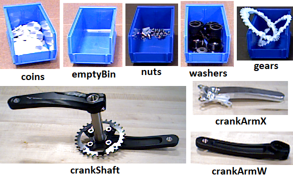
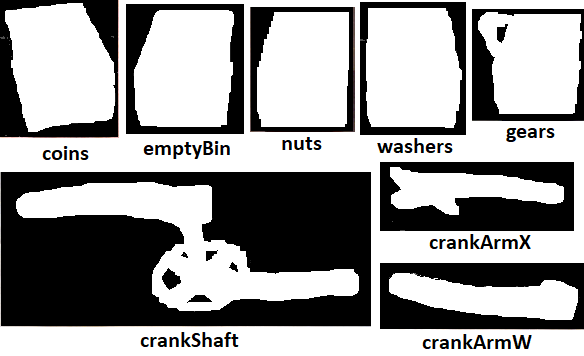
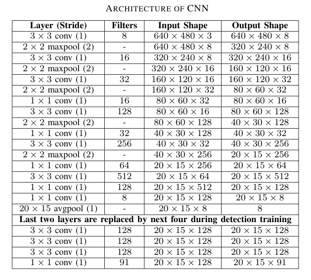
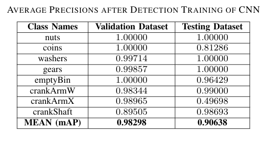
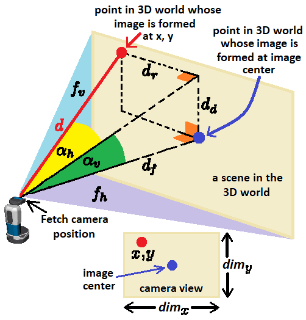
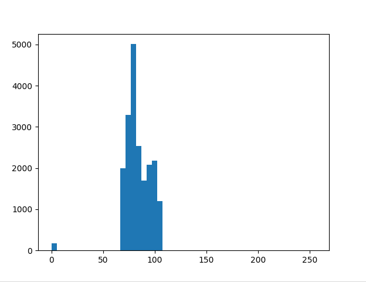

# Objective: 
Using mobile robots in an industry 4.0 setting for working alongside human operators and assisting them to increase the efficiency of manufacturing tasks.

**A *Trailer* of Final Result:**

| | |
|:---:|:---:|
|  |  |
| [**YouTube Link**](https://youtu.be/klYFTt6hRl0) | [**YouTube Link**](https://youtu.be/IzMjBAbnvCU) |

---

Mobile robots have gained huge prominence in manufacturing plants owing to its benefits such as safety of humans and demand for high efficiency. The advancements in technology have enabled manufacturers to develop robots suitable to their operational needs and carry out their implementation for their applications. 

Following are some of the crucial benefits of mobile robots:

**Enhanced flexibility:**
As on-board sensors and cameras are utilized in robots for their operations, they offer agility and flexibility. It does not follow the predetermined paths; it creates its own dynamic and efficient pathways from a particular point to the destination by tackling obstacles. 

**Increase in safety:**
Mobile robots are equipped with different types of sensors and cameras. These enable the safety in its operation. It avoids different obstacles by interpreting the environment, understanding different scenarios, and finding its way. 

**Better scalability:**
As mobile robots can be programmed for tasks such as picking up items and dropping them at destinations for few items, they can be reprogrammed for more items. The implementation of modular deployment system is possible with the increase in operational needs. 

**Ease in shifting between facilities:**
Many manufacturers do not opt for automation as they need to move them to new facilities if need arises. If an automation system is purchased and the company needs to shift to new facility in the next three years, the whole system needs to be dismantled to move. However, mobile robots are easy to move and will not take much efforts to move from one place to another. 

But owing to their mobility, there comes additional challenges for proper positioning or localization when it comes to interacting with physical objects. In this work, we use a Fetch mobile robot equipped with an RGBD camera and a manipulator arm to pick up some objects in a factory environment. **The overall objective is to analyze the position and orientation of the objects and then use the robotic arm to pick them up**.

The overall idea is to have the fetch robot pick up all the different objects required by the human workers in a factory for their tasks, and carry it to them. Basically, assisting the humam operators to with the small tasks so that they can concentrate on the more complicated tasks like assembling different parts together to create a complete product, etc.

The fetch robot is fitted with a [Primesense Carmine 1.09 short-range RGBD sensor](http://xtionprolive.com/primesense-carmine-1.09#:~:text=This%20is%20the%20Primesense%20Carmine,based%20on%20the%20Primesense%20technology.&text=The%203D%20depth%20Sensor%20sees%20and%20tracks%20user%20movements%20within%20a%20scene) as its depth camera. It also has a 7 Degree of Freedom (DOF) arm and has an on-board Intel Core i5 computer. 
Details of the design of the Fetch robot can be found in this [paper](https://www.semanticscholar.org/paper/Fetch-%26-Freight-%3A-Standard-Platforms-for-Service-Wise-Ferguson/569cd8dd665f78ae021b715adea6dd30db5e499d?p2df). The paper is also present [here](documents/FetchAndFreight2016.pdf) in this repository.

Several other help links and topics are also mentioned in this [file](documents/tutorial_for_fetch_robot.txt) about the fetch robot.

# Requirements: 
* Algorithm should be able to detect the different objects to be picked up.
* Algorithm should be able to find the 3D location and orientation of the objects and pick them up with the robot arm.
* Algorithm should be able to run without the help of a GPU completely on the computer of the robot.
* All software should be open source. 

# Current Framework: 
* OpenCV, Robot Operating System (ROS), PointCloud Library (PCL), Tensorflow, Ubuntu 16.04. 
* Python, C++.
* [Fetch robot.](https://fetchrobotics.com/)
* NVIDIA Tesla P100 GPU for training the CNN.

#### Fetch Robot:


#### Objects to be picked up:


[ **NOTE:** Some of these objects are small in size and they are likely to be stored inside some containers in the factory warehouse. Hence, images of those objects are created with the containing bin itself.
Picking up procedure for the **emptyBin** is the same as picking up the bins with objects in it linke **nuts**, **coins**, **washers**, and **gears**. And the pick up procedure of the **crankShaft** is the same as the picking up **crankArmX** and **crankArmW** as these are parts of the crankshaft itself. So, we only show picking up the **emptyBin** and **crankShaft** in this repository. ]

# Dataset Creation:
A binary mask is created by image thresholding for each of these images as shown in the following figure.



The total number of sample images of the objects are divided into three groups namely: **training samples**, **testing samples** and **validation samples**. The overall number of such sample images of each object to create these datasets is shown in following Table. Only images of training samples set are used to create the training dataset and viceversa for the testing and validation datasets, so that there are no overlap of samples among the final datasets created.

| | | | |
|:---:|:---:|:---:|:---:|
| **Class Names** | **Number of Training Samples** | **Number of Validation Samples** | **Number of Testing Samples** |
| nuts | 8 | 2 | 2 |
| coins | 8 | 2 | 2 |
| washers | 8 | 2 | 2 |
| gears | 20 | 2 | 2 |
| emptyBin | 8 | 2 | 2 |
| crankArmW | 38 | 4 | 4 |
| crankArmX | 14 | 2 | 2 |
| crankShaft | 20 | 2 | 2 |

The size of the images in the datasets are **640 x 480** pixels. This is because the Fetch robot camera has a frame size of **640 x 480**. So, the dataset images are of the same size, so that the CNN can take the RGB images from the camera directly as input without any downsampling.
Now to create the actual images of the datasets, several background images of a warehouse environment is taken and then 640 x 480 blocks are cropped out of these images from random locations. Samples of different objects are then affixed on these 640 x 480 blocks randomly. The samples are also flipped vertically and horizontally while affixing them. For each such image created, the class names of the objects and their position and size of bounding boxes are recorded in a separate file. Some sample images obtained are shown below. 


# CNN Architecture and Training Statistics: 

### CNN Architecture:

The CNN architecture used here is shown in the following table. 



The input to this network are 640 x 480 RGB images directly from the Fetch camera. Every convolution layer is followed by a leaky Relu activation (with **alpha = 0.1**) and batch normalization layer. The last convolution layer opens into a global average pooling layer with a sigmoid activation. The output is a **8** element vector which predicts the probability of each class object in the input image. The network is trained in two stages. 
First, it is only trained for classification, where it predicts what object is present in the input image without any bounding box prediction. This training took **44** epochs and approximately **25** hours on an **NVIDIA Tesla P100 GPU**, to reach a validation accuracy of **92.92 %** with a learning rate of **0.0001**. 

After this, the last convolutional layer is replaced with **3** new convolutional layers for detection training. This makes the network more powerful and reshapes the last layer into the required number of output elements needed. 
The first layer of the network has a height and width of **640 x 480**. This is reduced to **20 x 15** in the last layers. Each of these grid cells in the last layer is a potential location for an object and for each grid cell, **7** anchor boxes are predefined. The dimensions of these boxes are defined to suit the shapes of the detected objects. Every anchor box has **15** elements for object detection. **2** for offsets in x, y coordinates of the bounding box center, next **2** are the height and width. **5th** one is a score showing the probability of the presence of an object in the box and last **8** are an **8** element one-hot vector for the **8** object classes. Hence, the last layer has a depth of **7 x (5 + 8) = 91**. Non-maximum suppression (NMS) was used to remove redundant bounding boxes based on the intersection over union (IOU) value.

### Detection Results:

Detection training of the CNN took about **10** hours on the NVIDIA Tesla P100 GPU for **29** epochs with a learning rate of **0.001** for the first **26** epochs and then changed to **0.0001** for the last **3**. 
The overall mean average precision (mAP) for determining the detection performance of a CNN, is calculated over the testing and validation datasets and shown below for the different classes. 



A few example detection results on the input images are shown in the following figure.


The weights of the model for [classification](codes/saved_models) and [detection](saved_models_detector) are also present in this repository.

# Mapping 2D Bounding Box to 3D Point Cloud Domain:

For estimating the pose of the object in 3D space, the depth image of the Fetch camera, its dimensions **dim_x = 640, dim_y = 480** and its field of view (FOV) are used. Fetch camera has a horizontal FOV of **f_h = 54 degrees** and vertical FOV of **f_v = 45 degrees**. To map any pixel **(x, y)** of the RGB image into 3D space, first the horizontal and vertical angles (**alpha_h, alpha_v**) subtended by this pixel relative to the corresponding FOVs are calculated as follows:
```
alpha_h = (x - 0.5 * dim_x) * f_h / dim_x
alpha_v = (y - 0.5 * dim_y) * f_v / dim_y
```
Then using its depth value (**d**) of the pixel, the distance of pixel in the front (**d_f**), right (**d_r**), down (**d_d**) directions are calculated which are then mapped into the right handed coordinate (**X, Y, Z**) using the following equation:
```
d_r = d * sin(alpha_h)
d_d = d * sin(alpha_v) 
d_f = d * cos(alpha_h) * cos(alpha_v)
X = d_f ; Y = -d_r ; Z = -d_d   
```
The next figure shows a schematic of the point (**x, y**) along with the related angles and distances, which is used to derive the above equations.



There is however a problem that sometimes the value of **d** at the (**x, y**) location in the depth frame is read as **0**. This happens because, sometimes the projected IR rays from the Fetch depth camera does not get reflected back to the camera from all locations. To solve this, while measuring **d** a histogram of the depths of all pixels in a window around (**x, y**) is considered, and the most populated bin of the histogram is considered as the value of **d**. 
The following figure shows one such histograms. 



Now, after recognizing objects using the CNN, the depths of the pixels of the corner points of their predicted bounding boxes are mapped into 3D space using the above equations as mentioned earlier. These 3D points are then transferred into the point cloud (PCL) domain.

# PCL Processing and 3D Pose Estimation:

| |
|:---:|
|  |
| **Figure: PCL_processing_crankShaft** 
**Top Left:** 2D bounding box created by CNN around the identified crankShaft shown in RGB image. **Top Right:** Corresponding depth image. **Bottom:** PCL domain showing points belonging to the table surface (**red**) detected by RANSAC. Corner points from predicted 2D bounding box is projected to PCL domain and the crankShaft OPCL is extracted. 3D tight cuboid bounding box (**green**) is fitted to the OPCL. |

At first, all 3D points in the point cloud which belongs to the surface on which the object is sitting, is identified by fitting a plane to the 3D points using RANSAC algorithm. Then all the 3D points included and below this surface are ignored. This surface is shown in the above figure (bottom image) in red color. 

After this, the region in the remaining point cloud bounded by the 3D points, which are mapped from the corners of the predicted 2D bounding box, is cropped out as the object point cloud (OPCL) and a cubic 3D bounding box is created around it, which tightly fits the OPCL. This is shown in the above figure (bottom image). 

| |
|:---:|
|  |
| **Figure: 3D_bounding_box_emptyBin_crankShaft** 
**Left:** 3D tight cuboid bounding box (**green**) created around the emptyBin OPCL. The box fits the OPCL very well as the object is cuboid in shape. **Right:** 3D bounding box (**green**) is created around the crankShaft OPCL. Box does not fit well to the object, since it is not cuboid in shape. Hence, a straight line (**blue**) is fitted to the crankshaft OPCL. |

Now, if the object is a cuboid object, like the **emptyBin** or any other objects which were contained in the bins, then this cubic 3D bounding box aligns very well with the object shape (as seen in figure **3D_bounding_box_emptyBin_crankShaft** left image). So, the orientation of the box itself is then used to position the Fetch arm to pickup the object. The Fetch arm is positioned vertically to one of the lateral sides of the 3D bounding box with the gripper open and the arm is gradually lowered to the level equal to the height of the box. This causes the side wall of the bin to come in-between the gripper fingers and then the gripper is closed to grab the bin. The arm is then raised to pick up the object.

However, if the object is not cuboid, like the **crankShaft**, then the 3D bounding box will not fit it very well. Therefore, the Fetch arm may fail to pick up the object even if it tries to grab it using the orientation of the lateral sides of the 3D bounding box, as not all the lateral sides have 3D points aligned with them (as seen in figure **PCL_processing_crankShaft** bottom image). Hence, for these kind of objects, a 3D straight line segment is fitted to the points of the OPCL using RANSAC as seen in figure **3D_bounding_box_emptyBin_crankShaft** right image). Since this segment is a straight line, it always includes 3D points belonging to the OPCL in it. Hence, there is no chance of a failed pickup if the Fetch arm tries to grab the object using the orientation of this straight line segment. So, for the crankShaft and crank arm objects, the Fetch arm is positioned vertically on the center of the fitted 3D straight line and similar manipulation movement is done (as in the case of the emptyBin) to pick up the object. 

# Results:
There is a video file that can be used to test the output the algorithm.
The raw video file, a recorded video showing the final detection is present in the [videos](videos) directory.

The output [detection_video](videos/detection_video.avi) is recorded by running the algorithm on the [raw_input_video](videos/raw_input_video.avi) file.

The detection video can also be found on [Youtube](https://www.youtube.com/) at the following link:
* [final box detection video with distance measurement](https://www.youtube.com/watch?v=hQYESMS1604&feature=youtu.be)
* [combined video for box detection](https://www.youtube.com/watch?v=bSGtvHl_pHU)

A gif showing a glimpse of the box detection is also shown below.


This algorithm ran on the Odroid XU4 in real time at **14 Hz**.

# Observations:
* It can be seen that if the box is too near to the camera, (which is within 0.5 m) the box is not detected. This is because of the range limitation of the depth camera and the incapability of measuring the distance using rgb image at this close distance.
* Even if the claws obstruct the box to some extent, it can still be detected. This is because the processing is based on the modified rgb frame that cloaks the claws. But the detection flickers if the claws obstruct the box too much.
* Other than these two cases the detection is pretty stable and robust.
* Algorithm was able to run on the Odroid in real time at **14 Hz**

# Future Work:
Future work will include using the distance measured from this algorithm to be used to modulate the movement of the drone.
The drone is controlled using the **Robot Operating System (ROS)** which will take this **box detected** signal and the subsequent distance measurement as an input and try to perform the task of opening the box by the handle.


