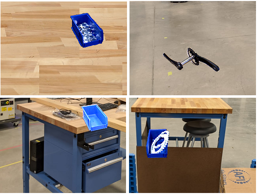

# Objective: 
Using mobile robots in an industry 4.0 setting for working alongside human operators and assisting them to increase the efficiency of manufacturing tasks.

**A *Trailer* of Final Result:**

| | |
|:---:|:---:|
|  |  |
| [**YouTube Link**](https://youtu.be/klYFTt6hRl0) | [**YouTube Link**](https://youtu.be/IzMjBAbnvCU) |

---

Mobile robots have gained huge prominence in manufacturing plants owing to its benefits such as safety of humans and demand for high efficiency. The advancements in technology have enabled manufacturers to develop robots suitable to their operational needs and carry out their implementation for their applications. 

Following are some of the crucial benefits of mobile robots:

**Enhanced flexibility:**
As on-board sensors and cameras are utilized in robots for their operations, they offer agility and flexibility. It does not follow the predetermined paths; it creates its own dynamic and efficient pathways from a particular point to the destination by tackling obstacles. 

**Increase in safety:**
Mobile robots are equipped with different types of sensors and cameras. These enable the safety in its operation. It avoids different obstacles by interpreting the environment, understanding different scenarios, and finding its way. 

**Better scalability:**
As mobile robots can be programmed for tasks such as picking up items and dropping them at destinations for few items, they can be reprogrammed for more items. The implementation of modular deployment system is possible with the increase in operational needs. 

**Ease in shifting between facilities:**
Many manufacturers do not opt for automation as they need to move them to new facilities if need arises. If an automation system is purchased and the company needs to shift to new facility in the next three years, the whole system needs to be dismantled to move. However, mobile robots are easy to move and will not take much efforts to move from one place to another. 

But owing to their mobility, there comes additional challenges for proper positioning or localization when it comes to interacting with physical objects. In this work, we use a Fetch mobile robot equipped with an RGBD camera and a manipulator arm to pick up some objects in a factory environment. **The overall objective is to analyze the position and orientation of the objects and then use the robotic arm to pick them up**.

The overall idea is to have the fetch robot pick up all the different objects required by the human workers in a factory for their tasks, and carry it to them. Basically, assisting the humam operators to with the small tasks so that they can concentrate on the more complicated tasks like assembling different parts together to create a complete product, etc.

The fetch robot is fitted with a [Primesense Carmine 1.09 short-range RGBD sensor](http://xtionprolive.com/primesense-carmine-1.09#:~:text=This%20is%20the%20Primesense%20Carmine,based%20on%20the%20Primesense%20technology.&text=The%203D%20depth%20Sensor%20sees%20and%20tracks%20user%20movements%20within%20a%20scene) as its depth camera. It also has a 7 Degree of Freedom (DOF) arm and has an on-board Intel Core i5 computer. 
Details of the design of the Fetch robot can be found in this [paper](https://www.semanticscholar.org/paper/Fetch-%26-Freight-%3A-Standard-Platforms-for-Service-Wise-Ferguson/569cd8dd665f78ae021b715adea6dd30db5e499d?p2df). The paper is also present [here](documents/FetchAndFreight2016.pdf) in this repository.

Several other help links and topics are also mentioned in this [file](documents/tutorial_for_fetch_robot.txt) about the fetch robot.

# Requirements: 
* Algorithm should be able to detect the different objects to be picked up.
* Algorithm should be able to find the 3D location and orientation of the objects and pick them up with the robot arm.
* Algorithm should be able to run without the help of a GPU completely on the computer of the robot.
* All software should be open source. 

# Current Framework: 
* OpenCV, Robot Operating System (ROS), PointCloud Library (PCL), Tensorflow, Ubuntu 16.04. 
* Python, C++.
* [Fetch robot.](https://fetchrobotics.com/)
* NVIDIA Tesla P100 GPU for training the CNN.

#### Fetch Robot:

#### Objects to be picked up:

[ **NOTE:** Some of these objects are small in size and they are likely to be stored inside some containers in the factory warehouse. Hence, images of those objects are created with the containing bin itself.
Picking up procedure for the **emptyBin** is the same as picking up the bins with objects in it linke **nuts**, **coins**, **washers**, and **gears**. And the pick up procedure of the **crankShaft** is the same as the picking up **crankArmX** and **crankArmW** as these are parts of the crankshaft itself. So, we only show picking up the **emptyBin** and **crankShaft** in this repository. ]

# Dataset Creation:
A binary mask is created by image thresholding for each of these images as shown in the following figure.

The total number of sample images of the objects are divided into three groups namely: **training samples**, **testing samples** and **validation samples**. The overall number of such sample images of each object to create these datasets is shown in following Table. Only images of training samples set are used to create the training dataset and viceversa for the testing and validation datasets, so that there are no overlap of samples among the final datasets created.

| | | | |
|:---:|:---:|:---:|:---:|
| **Class Names** | **Number of Training Samples** | **Number of Validation Samples** | **Number of Testing Samples** |
| nuts | 8 | 2 | 2 |
| coins | 8 | 2 | 2 |
| washers | 8 | 2 | 2 |
| gears | 20 | 2 | 2 |
| emptyBin | 8 | 2 | 2 |
| crankArmW | 38 | 4 | 4 |
| crankArmX | 14 | 2 | 2 |
| crankShaft | 20 | 2 | 2 |

The size of the images in the datasets are **640 x 480** pixels. This is because the Fetch robot camera has a frame size of **640 x 480**. So, the dataset images are of the same size, so that the CNN can take the RGB images from the camera directly as input without any downsampling.
Now to create the actual images of the datasets, several background images of a warehouse environment is taken and then 640 x 480 blocks are cropped out of these images from random locations. Samples of different objects are then affixed on these 640 x 480 blocks randomly. The samples are also flipped vertically and horizontally while affixing them. For each such image created, the class names of the objects and their position and size of bounding boxes are recorded in a separate file. Some sample images obtained are shown below. 

# CNN Architecture and Training Statistics: 

### CNN Architecture:

The CNN architecture used here is shown in the following table. 

The input to this network are 640 x 480 RGB images directly from the Fetch camera. Every convolution layer is followed by a leaky Relu activation (with **alpha = 0.1**) and batch normalization layer. The last convolution layer opens into a global average pooling layer with a sigmoid activation. The output is a **8** element vector which predicts the probability of each class object in the input image. The network is trained in two stages. 
First, it is only trained for classification, where it predicts what object is present in the input image without any bounding box prediction. This training took **44** epochs and approximately **25** hours on an **NVIDIA Tesla P100 GPU**, to reach a validation accuracy of **92.92 %** with a learning rate of **0.0001**. 

After this, the last convolutional layer is replaced with **3** new convolutional layers for detection training. This makes the network more powerful and reshapes the last layer into the required number of output elements needed. 
The first layer of the network has a height and width of **640 x 480**. This is reduced to **20 x 15** in the last layers. Each of these grid cells in the last layer is a potential location for an object and for each grid cell, **7** anchor boxes are predefined. The dimensions of these boxes are defined to suit the shapes of the detected objects. Every anchor box has **15** elements for object detection. **2** for offsets in x, y coordinates of the bounding box center, next **2** are the height and width. **5th** one is a score showing the probability of the presence of an object in the box and last **8** are an **8** element one-hot vector for the **8** object classes. Hence, the last layer has a depth of **7 x (5 + 8) = 91**. Non-maximum suppression (NMS) was used to remove redundant bounding boxes based on the intersection over union (IOU) value.

### Detection Results:

Detection training of the CNN took about **10** hours on the NVIDIA Tesla P100 GPU for **29** epochs with a learning rate of **0.001** for the first **26** epochs and then changed to **0.0001** for the last **3**. 
The overall mean average precision (mAP) for determining the detection performance of a CNN, is calculated over the testing and validation datasets as shown below for the different classes. 

A few example detection results on the input images are shown in the following figure.

### Stage 1:
The videos from the realsense is read as a numpy array. This included both the **rgb frame** as well as the depth frame.
The **depth frame** is of the same dimension as the rgb frame (640 x 480 pixels) but each pixel in the frame has a value equal to the distance of the object represented by that pixel from the camera in mm.

### Stage 2:
When the box is nearer to the camera, the claws will be obstructing parts of the box. But it is already known at which pixels the claws are visible.
So the pixels for the claws are replaced by the other surrounding background pixels to that the overall frame has no visible claws and only the box and the background are visible. 
The following figure shows the **original frame** (left) and the processed frame with the claws removed. This frame will be used for further processing. This frame will be referred to as **modified rgb frame** (right) from now onwards.

### Stage 3:
The modified rgb frames from stage 2, (claws removed) are then subjected to edge detection and all the contours from these edges are found out. This **contour frame** (top right) is shown below.
These contours are then filtered based on their size and area so that most of the unwanted contours get removed. This will be called **filtered contour frame** (bottom left).
This filtered contour frame is also shown which includes the contour of the box and some other similar contours. These contours are then drawn as filled blocks in a new frame to create a mask.
This will be called **contour mask** (bottom right).

However, the size of this box contour will not stay fixed. It will change depending on the distance of the box from the camera.
So the size and area filters applied to the contour frame cannot have a fixed threshold, but has to be a range.

### Stage 4:
After this, the modified rgb frame is filtered with a color filter, so that only the objects which are within a range of color, remains visible.
This **color mask** (left) is shown below. This color mask is then combined with the contour mask created earlier in stage 3 to remove the last remaining unwanted contours. 
This creates the **final contour frame** (right) shown below.

This two stage detection (with contour mask and color mask) is done to make the algorithm robust. 
Sometimes with only contour dectection, often the adjacent contours gets merged which makes the overall contour of the box, include parts of other adjacent objects or backgrounds as well.
Hence, to prevent that the color mask filter is also used on top of it.

### Creating an Support Vector Machine model for the Box:
This final contour frame is used as a mask to crop out parts of the original rgb frame. The **Histogram of Oriented Gradient (HOG)** features are then extracted from all of these cropped out parts.
These HOG features are then used to create a positive training set for a **Support Vector Machine (SVM)**. 
Negative examples are generated from some of the other unwanted contour HOG features. Then model is also trained with other negetive examples collected from environments outside the lab.
A **Hard Negative Mining** is also performed with some of the difficult negetive examples to make the overall model more robust.
The images below shows the **cropped out portions** (left) and the modified rgb frame and the **HOG features** (right) extracted from them, which will be used to train the SVM.
The HOG features helps to identify the texture of the box. It gives an idea of its shape.

This stage is not executed during the real time execution of the box detection code. 
It is only done once at the beginning to create the SVM model from the training data. This SVM model is saved as [model.p](codes/model.p).

#### Procedure for creating the SVM model:
The [svm_data.tar.gz](codes/svm_data.tar.gz) file has to be extacted. This will create have a **train** and a **test** directory.
The train directory has 117 positive examples of the box and 296 negative examples (all are cropped images like the ones shown above).
The [train_svm.py](codes/train_svm.py) script has to be run to create the [model.p](codes/model.p) file.

However an already created [model.p](codes/model.p) is present in this repository (which is an already trained SVM model) which can also be used.

### Stage 5:
The HOG features from the final contour found in stage 4 are extracted and fed to this SVM model found in the file [model.p](codes/model.p).
If the final contour really represents the box, then the output of the model should be **True** else **False**.
So if the model output is True, then it is confirmed that the box is detected.
Use of the SVM ensures that there are no false detections or unwanted contours left behind in the final contour frame.

# Finding the Distance of the Box:
Once the final box contour is found, a **rotated rectangle** ( **cyan** in color ) is drawn around it as shown in the **final detection frame**.
The position of the handle of the box is inferred from this bounding rectangle.
Since the corner vertices and angle of tilt of the rectangle is known, a rotation matrix transformation is able to find the exact loaction of the box handle.
This is marked by the **purple dot** inside the bounding rectangle. The detected box and the handle are shown below.

Now, the Realsense R200 gives a good measure of the distance in a range of **0.5 mm to 2 mm**. 
So, in this code if the distance of the camera from the box is **beyond 1.5 mm** the distance is estimated using the approximate focal length of the **rgb camera**.

The approximate focal length is found out based on the assumption that the size of the object will be the same as the size of its image, if the object is at the focal length of the camera.

**Focal Length (F) = Object Distance (D) x Image Size (P) / Object Size (W)**

Within **0.5 mm and 1.5 mm** the distance is measured using the **depth image**.
The value of every pixels of the region of the frame where the final contour was detected is taken into account and a historgram of these values is created.
This is because there may be a few values that may be from the pixels which actually belong to the background. 
Also there may be some fluctuations in the depth frame as well, which may lead to some sudden 0 values for some pixels even if they belong to the box contour.
But these erronous pixels are not very large in number. 
So if a historgram of the number of pixels at different distance values, is created, then it is seen that the majority of the pixels are belonging to the bin that gives the correct distance of the box.
Hence, this distance corresponding to the group of majority of the pixels is considered as the detected distance of the box.
An image of such a historgram is shown below. It shows the peak as well which belongs bin that represents the actual distance of the box.

**Below 0.5 mm** however, there is no proper way to measure the distance solely based on rgb or depth image. 
The final contour of the box becomes bigger than the frame size itself and the depth frame values are also not usable.
So in such a position the drone either has to move blindly or has to use some other sensor like sonar etc.
But this is not much of a problem as in the final configuration the drone will have the claws mounted on a front rod or boom, which will be around 0.4 m anyways.
So the camera is at 0.5 m from the box will imply that the claws are at only 0.1 m from the box, which is a very short distance. 
Hence, moving blindly in this short distance is not a problem.

The final distances **in meters** measured is also displayed on the final detected frame. 
This distance show how much the camera or the drone has to be moved so that the **red crosshairs** drawn on the frame will merge with the **purple dot** showing the position of the handle.
**X axis** is directed **Outward** from the plane of the frame (towards the viewer).
**Y axis** is directed to the **Left**.
**Z axis** is directed **Upwards**.

# Results:
There is a video file that can be used to test the output the algorithm.
The raw video file, a recorded video showing the final detection is present in the [videos](videos) directory.

The output [detection_video](videos/detection_video.avi) is recorded by running the algorithm on the [raw_input_video](videos/raw_input_video.avi) file.

The detection video can also be found on [Youtube](https://www.youtube.com/) at the following link:
* [final box detection video with distance measurement](https://www.youtube.com/watch?v=hQYESMS1604&feature=youtu.be)
* [combined video for box detection](https://www.youtube.com/watch?v=bSGtvHl_pHU)

A gif showing a glimpse of the box detection is also shown below.

This algorithm ran on the Odroid XU4 in real time at **14 Hz**.

# Observations:
* It can be seen that if the box is too near to the camera, (which is within 0.5 m) the box is not detected. This is because of the range limitation of the depth camera and the incapability of measuring the distance using rgb image at this close distance.
* Even if the claws obstruct the box to some extent, it can still be detected. This is because the processing is based on the modified rgb frame that cloaks the claws. But the detection flickers if the claws obstruct the box too much.
* Other than these two cases the detection is pretty stable and robust.
* Algorithm was able to run on the Odroid in real time at **14 Hz**

# Future Work:
Future work will include using the distance measured from this algorithm to be used to modulate the movement of the drone.
The drone is controlled using the **Robot Operating System (ROS)** which will take this **box detected** signal and the subsequent distance measurement as an input and try to perform the task of opening the box by the handle.

