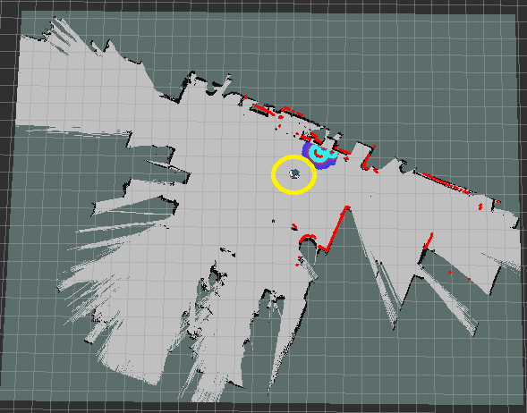

# Objective: 
Using mobile robots in an industry 4.0 setting for working alongside human operators and assisting them to increase the efficiency of manufacturing tasks.
The mobile factory robot identifies different objects using deep learning and computer vision with its onboard 3D camera, analyze their position and orientation using point cloud processing and pick them up from different poses using its manipulator arm. The robot then carries the objects to the human workers in the factory for further tasks.

**A *Trailer* of Final Result:**

| | | |
|:---:|:---:|:---:|
|  |  |  |
| [**YouTube Link**](https://youtu.be/klYFTt6hRl0) | [**YouTube Link**](https://youtu.be/IzMjBAbnvCU) | [**YouTube Link**](https://youtu.be/NkO_WeDJ9Ng) |

---

Mobile robots have gained huge prominence in manufacturing plants owing to its benefits such as safety of humans and demand for high efficiency. The advancements in technology have enabled manufacturers to develop robots suitable to their operational needs and carry out their implementation for their applications. 

Following are some of the crucial benefits of mobile robots:

**Enhanced flexibility:**
As on-board sensors and cameras are utilized in robots for their operations, they offer agility and flexibility. It does not follow the predetermined paths; it creates its own dynamic and efficient pathways from a particular point to the destination by tackling obstacles. 

**Increase in safety:**
Mobile robots are equipped with different types of sensors and cameras. These enable the safety in its operation. It avoids different obstacles by interpreting the environment, understanding different scenarios, and finding its way. 

**Better scalability:**
As mobile robots can be programmed for tasks such as picking up items and dropping them at destinations for few items, they can be reprogrammed for more items. The implementation of modular deployment system is possible with the increase in operational needs. 

**Ease in shifting between facilities:**
Many manufacturers do not opt for automation as they need to move them to new facilities if need arises. If an automation system is purchased and the company needs to shift to new facility in the next three years, the whole system needs to be dismantled to move. However, mobile robots are easy to move and will not take much efforts to move from one place to another. 

But owing to their mobility, there comes additional challenges for proper positioning or localization when it comes to interacting with physical objects. In this work, we use a Fetch mobile robot equipped with an RGBD camera and a manipulator arm to pick up some objects in a factory environment. **The overall objective is to analyze the position and orientation of the objects and then use the robotic arm to pick them up**.

The overall idea is to have the fetch robot pick up all the different objects required by the human workers in a factory for their tasks, and carry it to them. Basically, assisting the humam operators with the small tasks so that they can concentrate on the more complicated tasks like assembling different parts together to create a complete product, etc.

The fetch robot is fitted with a [Primesense Carmine 1.09 short-range RGBD sensor](http://xtionprolive.com/primesense-carmine-1.09#:~:text=This%20is%20the%20Primesense%20Carmine,based%20on%20the%20Primesense%20technology.&text=The%203D%20depth%20Sensor%20sees%20and%20tracks%20user%20movements%20within%20a%20scene) as its depth camera. It also has a 7 Degree of Freedom (DOF) arm and has an on-board Intel Core i5 computer. 
Details of the design of the Fetch robot can be found in this [paper](https://www.semanticscholar.org/paper/Fetch-%26-Freight-%3A-Standard-Platforms-for-Service-Wise-Ferguson/569cd8dd665f78ae021b715adea6dd30db5e499d?p2df). The paper is also present [here](documents/FetchAndFreight2016.pdf) in this repository.

Several other help links and topics are also mentioned in this [file](documents/tutorial_for_fetch_robot.txt) about the fetch robot.

# Requirements: 
* Algorithm should be able to detect the different objects to be picked up.
* Algorithm should be able to find the 3D location and orientation of the objects and pick them up with the robot arm.
* Algorithm should be able to run without the help of a GPU completely on the computer of the robot.
* All software should be open source. 

# Current Framework: 
* OpenCV, Robot Operating System (ROS), PointCloud Library (PCL), Tensorflow, Ubuntu 16.04. 
* Python, C++.
* [Fetch robot.](https://fetchrobotics.com/)
* NVIDIA Tesla P100 GPU for training the CNN.

#### Fetch Robot:


#### Objects to be picked up:


[ **NOTE:** Some of these objects are small in size and they are likely to be stored inside some containers in the factory warehouse. Hence, images of those objects are created with the containing bin itself.
Picking up procedure for the **emptyBin** is the same as picking up the bins with objects in it linke **nuts**, **coins**, **washers**, and **gears**. And the pick up procedure of the **crankShaft** is the same as the picking up **crankArmX** and **crankArmW** as these are parts of the crankshaft itself. So, we only show picking up the **emptyBin** and **crankShaft** in this repository. ]

# Dataset Creation:
A binary mask is created by image thresholding for each of these images as shown in the following figure.


The total number of sample images of the objects are divided into three groups namely: **training samples**, **testing samples** and **validation samples**. The overall number of such sample images of each object to create these datasets is shown in following Table. Only images of training samples set are used to create the training dataset and viceversa for the testing and validation datasets, so that there are no overlap of samples among the final datasets created.

| | | | |
|:---:|:---:|:---:|:---:|
| **Class Names** | **Number of Training Samples** | **Number of Validation Samples** | **Number of Testing Samples** |
| nuts | 8 | 2 | 2 |
| coins | 8 | 2 | 2 |
| washers | 8 | 2 | 2 |
| gears | 20 | 2 | 2 |
| emptyBin | 8 | 2 | 2 |
| crankArmW | 38 | 4 | 4 |
| crankArmX | 14 | 2 | 2 |
| crankShaft | 20 | 2 | 2 |

The size of the images in the datasets are **640 x 480** pixels. This is because the Fetch robot camera has a frame size of **640 x 480**. So, the dataset images are of the same size, so that the CNN can take the RGB images from the camera directly as input without any downsampling.
Now to create the actual images of the datasets, several background images of a warehouse environment is taken and then 640 x 480 blocks are cropped out of these images from random locations. Samples of different objects are then affixed on these 640 x 480 blocks randomly. The samples are also flipped vertically and horizontally while affixing them. For each such image created, the class names of the objects and their position and size of bounding boxes are recorded in a separate file. Some sample images obtained are shown below. 


# CNN Architecture and Training Statistics: 

### CNN Architecture:

The CNN architecture used here is shown in the following table. 


The input to this network are 640 x 480 RGB images directly from the Fetch camera. Every convolution layer is followed by a leaky Relu activation (with **alpha = 0.1**) and batch normalization layer. The last convolution layer opens into a global average pooling layer with a sigmoid activation. The output is a **8** element vector which predicts the probability of each class object in the input image. The network is trained in two stages. 
First, it is only trained for classification, where it predicts what object is present in the input image without any bounding box prediction. This training took **44** epochs and approximately **25** hours on an **NVIDIA Tesla P100 GPU**, to reach a validation accuracy of **92.92 %** with a learning rate of **0.0001**. 

After this, the last convolutional layer is replaced with **3** new convolutional layers for detection training. This makes the network more powerful and reshapes the last layer into the required number of output elements needed. 
The first layer of the network has a height and width of **640 x 480**. This is reduced to **20 x 15** in the last layers. Each of these grid cells in the last layer is a potential location for an object and for each grid cell, **7** anchor boxes are predefined. The dimensions of these boxes are defined to suit the shapes of the detected objects. Every anchor box has **15** elements for object detection. **2** for offsets in x, y coordinates of the bounding box center, next **2** are the height and width. **5th** one is a score showing the probability of the presence of an object in the box and last **8** are an **8** element one-hot vector for the **8** object classes. Hence, the last layer has a depth of **7 x (5 + 8) = 91**. Non-maximum suppression (NMS) was used to remove redundant bounding boxes based on the intersection over union (IOU) value.

### Detection Results:

Detection training of the CNN took about **10** hours on the NVIDIA Tesla P100 GPU for **29** epochs with a learning rate of **0.001** for the first **26** epochs and then changed to **0.0001** for the last **3**. 
The overall mean average precision (mAP) for determining the detection performance of a CNN, is calculated over the testing and validation datasets and shown below for the different classes. 


A few example detection results on the input images are shown in the following figure. The images shows that the CNN was able to recognize the known objects and create bounding box around them and ignore the unwanted objects.


The weights of the model for [classification](codes/saved_models) and [detection](saved_models_detector) are also present in this repository.

# Mapping 2D Bounding Box to 3D Point Cloud Domain:

For estimating the pose of the object in 3D space, the depth image of the Fetch camera, its dimensions **dim_x = 640, dim_y = 480** and its field of view (FOV) are used. Fetch camera has a horizontal FOV of **f_h = 54 degrees** and vertical FOV of **f_v = 45 degrees**. To map any pixel **(x, y)** of the RGB image into 3D space, first the horizontal and vertical angles (**alpha_h, alpha_v**) subtended by this pixel relative to the corresponding FOVs are calculated as follows:
```
alpha_h = (x - 0.5 * dim_x) * f_h / dim_x
alpha_v = (y - 0.5 * dim_y) * f_v / dim_y
```
Then using its depth value (**d**) of the pixel, the distance of pixel in the front (**d_f**), right (**d_r**), down (**d_d**) directions are calculated which are then mapped into the right handed coordinate (**X, Y, Z**) using the following equation:
```
d_r = d * sin(alpha_h)
d_d = d * sin(alpha_v) 
d_f = d * cos(alpha_h) * cos(alpha_v)
X = d_f ; Y = -d_r ; Z = -d_d   
```
The next figure shows a schematic of the point (**x, y**) along with the related angles and distances, which is used to derive the above equations.


There is however a problem that sometimes the value of **d** at the (**x, y**) location in the depth frame is read as **0**. This happens because, sometimes the projected IR rays from the Fetch depth camera does not get reflected back to the camera from all locations. To solve this, while measuring **d** a histogram of the depths of all pixels in a window around (**x, y**) is considered, and the most populated bin of the histogram is considered as the value of **d**. 
The following figure shows one such histograms. 


Now, after recognizing objects using the CNN, the depths of the pixels of the corner points of their predicted bounding boxes are mapped into 3D space using the above equations as mentioned earlier. These 3D points are then transferred into the point cloud (PCL) domain.

# PCL Processing and 3D Pose Estimation:

| |
|:---:|
|  |
| **Figure: PCL processing crankShaft** 
**Top Left:** 2D bounding box created by CNN around the identified crankShaft shown in RGB image. **Top Right:** Corresponding depth image. **Bottom:** PCL domain showing points belonging to the table surface (**red**) detected by RANSAC. Corner points from predicted 2D bounding box is projected to PCL domain and the crankShaft OPCL is extracted. 3D tight cuboid bounding box (**green**) is fitted to the OPCL. |

At first, all 3D points in the point cloud which belongs to the surface on which the object is sitting, is identified by fitting a plane to the 3D points using RANSAC algorithm. Then all the 3D points included and below this surface are ignored. This surface is shown in the above figure (bottom image) in red color. 

After this, the region in the remaining point cloud bounded by the 3D points, which are mapped from the corners of the predicted 2D bounding box, is cropped out as the object point cloud (OPCL) and a cubic 3D bounding box is created around it, which tightly fits the OPCL. This is shown in the above figure (bottom image). 

| |
|:---:|
|  |
| **Figure: 3D bounding box emptyBin crankShaft** 
**Left:** 3D tight cuboid bounding box (**green**) created around the emptyBin OPCL. The box fits the OPCL very well as the object is cuboid in shape. **Right:** 3D bounding box (**green**) is created around the crankShaft OPCL. Box does not fit well to the object, since it is not cuboid in shape. Hence, a straight line (**blue**) is fitted to the crankshaft OPCL. |

Now, if the object is a cuboid object, like the **emptyBin** or any other objects which were contained in the bins, then this cubic 3D bounding box aligns very well with the object shape (as seen in figure **3D_bounding_box_emptyBin_crankShaft** left image). So, the orientation of the box itself is then used to position the Fetch arm to pickup the object. The Fetch arm is positioned vertically to one of the lateral sides of the 3D bounding box with the gripper open and the arm is gradually lowered to the level equal to the height of the box. This causes the side wall of the bin to come in-between the gripper fingers and then the gripper is closed to grab the bin. The arm is then raised to pick up the object.

However, if the object is not cuboid, like the **crankShaft**, then the 3D bounding box will not fit it very well. Therefore, the Fetch arm may fail to pick up the object even if it tries to grab it using the orientation of the lateral sides of the 3D bounding box, as not all the lateral sides have 3D points aligned with them (as seen in figure **PCL_processing_crankShaft** bottom image). Hence, for these kind of objects, a 3D straight line segment is fitted to the points of the OPCL using RANSAC as seen in figure **3D_bounding_box_emptyBin_crankShaft** right image). Since this segment is a straight line, it always includes 3D points belonging to the OPCL in it. Hence, there is no chance of a failed pickup if the Fetch arm tries to grab the object using the orientation of this straight line segment. So, for the crankShaft and crank arm objects, the Fetch arm is positioned vertically on the center of the fitted 3D straight line and similar manipulation movement is done (as in the case of the emptyBin) to pick up the object. 

# Object Position Estimation Results:
The video showing the final **emptyBin** pickup is present in this [link](videos/blue_bin_pickup_without_ar_tag.mp4).
The video showing the final **crankShaft** pickup and drop is present in this [link](videos/crank_shaft_drop.mp4).

The videos of the object pickups can also be found on Youtube.
* [emptyBin pickup](https://youtu.be/klYFTt6hRl0).
* [crankShaft pickup and drop](https://www.youtube.com/watch?v=lmkMz9-IfYQ).

Gif showing a glimpse of the object pickups are also shown below.


# Building a Map of the Workshop Floor:

The overall objective of this project is to have the Fetch robot identify and pick up the objects from the table and put them inside a bin mounted on top of the Freight robot. So, initially both of these robots have to come near the table from their home position and be positioned there before the object detection process starts. 
In order for the robots to do this, a map of the overall workshop floor is created (as shown below) and way-points are set for the robots to follow. These way-points guide the robots from their home position to a place near the table.



# Picking up the Object:

To pick up the objects from the table, the Fetch arm undergoes a series of movements. These movements are carefully programmed over the course of several experimental trials. 


The Fetch positions itself at a distance of approximately **0.55 m** from the table (shown in **step 1**) and then unfolds its arm to the front (**step 2**). Then it raises the torso and extends the arm to the left (**step 3**) so that it does not collide with the table or the big blue bin mounted on the Freight to the right. After this, it brings its arm to the right (as shown in **step 4**). This is the position from where the Fetch will start its arm manipulation movements to pick up an identified object.


Once the initial arm movements are done, the Fetch now tries to identify the objects present on the table. It starts of from **step 4** and moves closer to a distance of **0.15 m** from the table (**step 5**). It then captures the RGB frames using its head camera (**step 6**) and uses the CNN to recognize the objects on the table one at a time. Once an object is identified a bounding box is created around it (**step 7**) and the coordinates of this box are projected into the PCL domain to estimate the pose of the object (as explained earlier). The Fetch now straightens its arm (**step 8**) and uses the estimated pose to move its arm to a position approximately **10 cm** above the object (**step 9**). The manipulation planning and movement in this case is done using the MoveIt package built into the Fetch software which takes in the estimated pose of the object as input. Thus, the joint angles and position of the arm can be slightly different in different trials. 
After this, the Fetch lowers its torso by **10 cm** and closes the gripper to grab the object (**step 10**). It then raises its torso again (**step 11**) by **10 cm** and straightens the wrist joint to lift the object from the table (**step 12**). 

# Big Blue Bin Detection:

Once an object is picked up successfully, it has to be placed in another big blue bin mounted on top of the Freight robot. 
The image processing used using the RGB and depth images used to detect the big blue bin are described as follows.

| |
|:---:|
|  |
| **Figure: Stages of image processing to detect the big blue bin** 
**A:** Raw RGB image. **B:** Corresponding colormapped depth image. **C:** Binary Color Filtered Image. **D:** Dilated Image **E:** Blue Channel of the Colormapped Depth Image. **F:** Combined Image created by combining the images shown in stages B and C. **G:** Final Binary Image. **H:** Image showing the contour surrounding the blue bin (**green**) and the bounding box around it (**red**). |

A color filter is first used on the RGB image (**A**) that separates out the region of the image containing blue shades. Since the bin is blue, most of the unwanted objects are removed by this filter resulting in a binary color filtered image as shown in **C**. 
This binary color filtered image has a number of gaps and holes in the region of the blue bin, which can result in several unwanted noisy contours in the later stages of filtering. Hence, this image is eroded first to remove the noisy spots and then dilated to cover up the gaps and holes in the blue bin region. This final dilated image is shown in **D**. 
The depth image from the Fetch camera is colormapped into a color image (**B**). The colors in this image represents the depths of the different pixels. Since the bin is closer to the Fetch than the other objects, it is represented in a blue shade. The blue channel of the colormapped depth image is then extracted (as shown in **E**). This image also contains some unwanted objects which are at the same distance from the camera as the blue bin.
Next, the blue channel of the colormapped depth image is combined with the dilated image obtained earlier. This gets rid of the unwanted objects in the colormapped depth image which are not the same color as the blue bin. This combined image is shown in **F**. 
Otsu's thresholding is used on the combined image from the last step in order to extract the foreground containing the objects closer to the camera from the background. This gives a final binary image that predominantly has only the blue bin in it as shown in **G**. 
The biggest contour is extracted from this final binary image which surrounds the blue bin and a bounding box is drawn around it. The contour is shown in **green** and the bounding box in **red** in **H**. 

The final detection is shown in the figure below. A point is also drawn on the inner wall of the bin. This inner wall point (henceforth referred to as **IWP**) is half way along the width of the bounding box and a fourth of the way along the height. Its position was chosen experimentally. The Fetch robot uses the location of this IWP to position itself before placing the objects inside the big blue bin. 


# Placing the Object in Big Blue Bin on Freight:

The Freight is stationed beside the table on one side of the Fetch robot. After picking up an object the Fetch robot will rotate to the right to look for this blue bin using its head camera. However, if the arm is oriented to the front of the robot, it blocks the view of the camera. Therefore, before the robot starts the rotation, the arm is oriented to the right (**step 13**). Note: the arm is not moved to the left because in that case the picked up object may hit other objects present on the table while rotating to the right. 

After the arm is moved to the right, the Fetch robot rotates to the right facing the Freight (**step 14**). If in case it is not able to detect the big blue bin, then it keeps on rotating while searching for the bin. This way, even if the Freight is randomly positioned next to the Fetch, the Fetch can still find it so long as it is within the surrounding neighborhood. After **5** complete **360 degrees** rotations, if the Fetch is still not able to detect the bin, then it sends out a **HELP** signal to alert a human operator. 


Once the big blue bin has been seen (**step 15**) and detected (**step 16**) using image processing and the IWP is determined, the Fetch uses the position of this IWP in 3D space (**x_iwp, y_iwp, z_iwp**) to position itself near the Freight. x_iwp represents how far the IWP is to the front of the Fetch, y_iwp represents how far it is to the right of the Fetch and z_iwp represents how high is from the ground. The Fetch arm is then moved to the front of the robot torso (**step 17**) and straightened (**step 18**). At this stage, the Fetch recalculates the position of the gripper end-effector in 3D space (**x_g, y_g, z_g**). It then moves forward or backward by (x_iwp - x_g) amount and also rotates sideways to nullify the difference (y_iwp - y_g). It does this to make sure that when it lowers the torso to put the object inside the big blue bin (**step 19**), it does not collide with the sidewalls of the bin in this step. The torso is lowered by **0.4 m** and the gripper is opened to release the object inside the bin. After this, the torso is again raised (**step 20**) and arm is moved to the right (**step 21**). The Fetch also reverses all the movements it has done before step $18$ to get back to its original position (as in **step 14**) near the table. Now, it turns back towards the table again (**step 22**) and starts to look for the next object on the table.

# Final movements:


Once all objects has been picked up, the Fetch stays near the table (**step 23**) and checks the table surface for any other remaining trained objects. If no other objects are detected for **4** consecutive attempts, the Fetch then moves away from the table (**step 24**) and moves its arm to the left (**step 25**) and folds it (**step 26**) in the reverse manner to how it had unfolded it earlier. The Freight at this stage moves away from the table carrying the objects inside the big blue bin to their destination (**step 27**). At this point, the Fetch waits here for further commands (**step 23**). It can be programmed to move to some other table for picking up other objects or move back to its home position.

# Video of Full Operation:

The videos of the object pickups can also be found on Youtube.
* [full operation](https://youtu.be/NkO_WeDJ9Ng).

And it can also be found in this [link](videos/video_with_comments_compressed.m4v)

Gif showing a glimpse of the full operation is also shown below.


# Observations:
* During PCL processing, sometimes some parts of an object may not be visible by a camera from certain angles, and because of this there are gaps in the PCL where there are not 3D points. These usually occurs in the regions falling in the shadows of objects. So, sometimes because of this lack of available points, the bounding box fitted to the object does not engulf the entire object region. 
* The algorithm can run on the onboard computer of the Fetch robot having **Intel core i7 processor** and the processing time for one image is **13 seconds**. 
* To have a quantitative evaluation of the position estimate the outputs of this algorithm, the position of the emptyBin is compared with that of the output of this algorithm by placing the emptyBin at **10** different locations. The ground truth position of the emptyBin is calculated using an AR code. The overall root mean square (RMS) error (calculated over **10** different positions of emptyBin) is **2.8 cm**.
Some of these positions are shown in the following image.


# Contributions:
* This project shows how to overcome some of the challenges of using mobile robotic manipulators in an industry environment where robots can work alongside human operators to assist them with their tasks thereby increasing the overall efficiency of the manufacturing process.
* Present an approach that uses 2D computer vision and PCL processing to create 3D pose estimation for mobile robotic manipulation tasks. The algorithm is agnostic to the underlying robotic platform.
* Created a synthetic dataset for the training the CNN used for identifying the objects.
* The proposed algorithm can run on the on-board computer of the Fetch robot that has an Intel core i7 processor. The processing time for one image is **13 seconds** without any GPU support.
* The algorithm is able to create tight bounding boxes around the identified objects. The position of these boxes provides enough information for manipulation of the Fetch arm for object pickup.

# Future Work:

One of the most useful future extension of this project will be to have the CNN trained on more objects in the warehouse. The small blue bins which are picked up by the Fetch, does not have any kind of lid on them, and because on this the movement of the Fetch arm after picking them up, has been designed in a way so that the bin does not get too inclined at any point, otherwise the objects inside the bin may fall off. But if there are some kind of lid on these bins, then the overall arm movements can be made more simplified. 
One of the limitation of the Fetch robot is that the camera is mounted in such a manner, that if the arm is extended in front of the robot, then it blocks the camera view. This is why, after picking up an object from the table, the arm is moved to the side to enable the Fetch to detect the big blue bin. If the Fetch is fitted with an additional camera mounted near the end-effector which will move around with the gripper, then the arm movements can be simplified a lot. Additionally, pressure or force sensors on the gripper fingers can help detect the gripping mechanism in a better manner for a variety of objects. In a more elaborate version of this project, there can be multiple Freights working with a the Fetch to transport several different objects to different tables.


